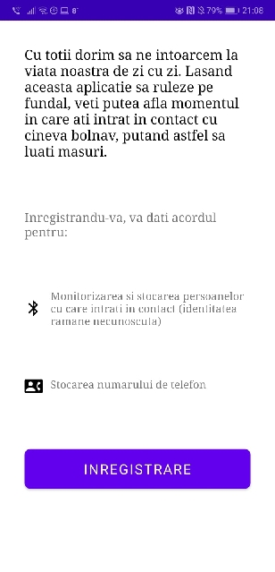
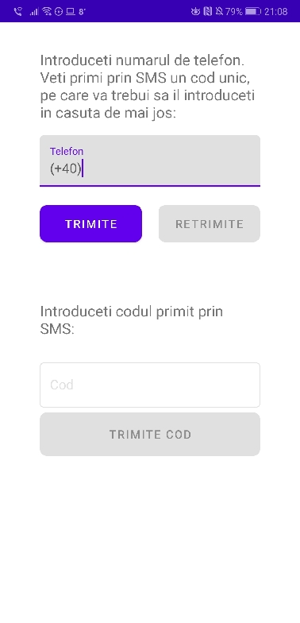
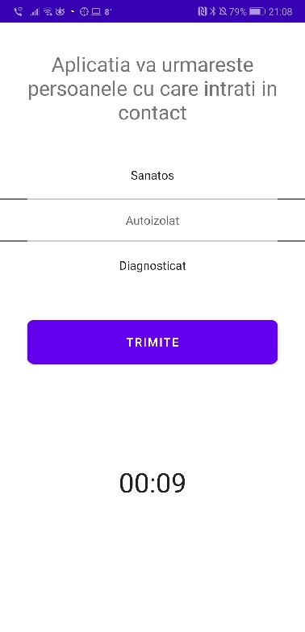

# CovidTracer
Contact tracing app used ONLY during the epidemic of the COVID-19 coronavirus disease.
I designed this app to help the romanian people to overcome this crisis faster by 
giving them a chance to inform others automatically of their status.

### Requirements
- Firebase duh
- Android
- Java
- maybe other stuff

### JSON schema for Firebase

2 tabels:
- users
    ```
    "users": {
        "user_id1" : {
            "phone" :
        }
        "user_id2" : {
            "phone" :
        }
    }
    ```

- users meetings
    ```
    "users_meetings" : {
        "user_id1" : {
            "meetings" : {
                "user_id_met1" : {
                    "found_timestamp" : ...
                    "lost_timestamp" : ...
                    "status" : ...
                }
                "user_id_met2" : {
                    "found_timestamp" : ...
                    "lost_timestamp" : ...
                    "status" : ...
                }
            }
        }
        "user_id2" : {
            "meetings" : {
                "user_id_met1" : {
                    "found_timestamp" : ...
                    "lost_timestamp" : ...
                    "status" : ...
                }
                "user_id_met2" : {
                    "found_timestamp" : ...
                    "lost_timestamp" : ...
                    "status" : ...
                }
            }
        }
    }
    ```
### TODO
1. Make basic app - done
2. Connect to Firebase - done
3. Add users to Firebase - done
4. Write code to collect user meetings - done
5. Write code for health status change and Firestore callbacks to send push notifications - done 
6. Work on design and other fluff (field restrictions, formatting, better looking app etc) - done
Important considerations: what to use as <b> user_id </b> to be unique? -> Ended up using the id generated by Firebase.

### How it works
After you sign in, you get an OTP token generated using Firebase Phone Auth (currently the phone number is hardcoded for Romanian prefixes, but this is easily changeable). After you login, the application starts a background service that constantly publishes and receives the Firestore Database UIDs, by using the Nearby Messages API from Google. When two devices are in close proximity (approximately 4-5m for Bluetooth + sonar, didn't test max distance since I can't go any further than my own home due to social distancing), their meetup is registered in Firestore.
From the NumberPicker in the logged in screen, you can choose your current health status (again, text is in Romanian) and press the button. This updates your health status in the database. Using Firestore Cloud Messages, there is a JavaScript function that triggers when this update happens and sends a push notification to the users that you have interacted with. 







### Addendum
I know that the code is horrible, hardcoded stuff everywhere, the design looks ugly. I coded this app in a few nights as a proof of concept, without any knowledge on Android whatsoever. I'll start working on a major overhaul soon, with a far better code design, as well as better looks. I decided to publish it simply because we are in a time of crisis and maybe some other developer can pick up on this and implement something useful to aid in ending COVID-19.

### Setup
Just follow the installation guide for Firestore. You also need to provide the API_KEY in the <b>gradle.properties</b> file, with the key API_KEY for the Nearby Messages API (<b>API_KEY=apikeyexample</b>).
